so some good results after trial and error

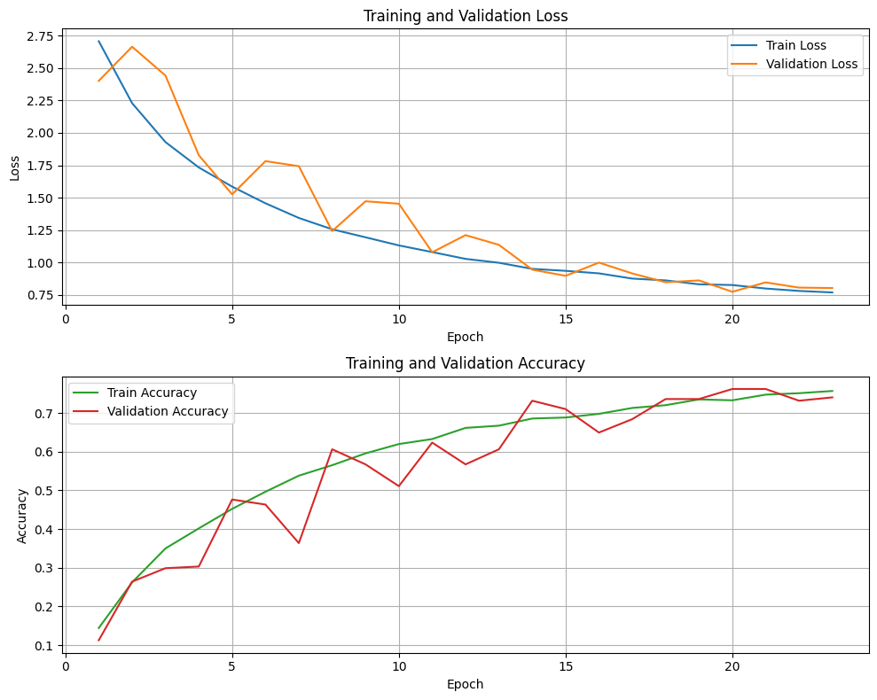
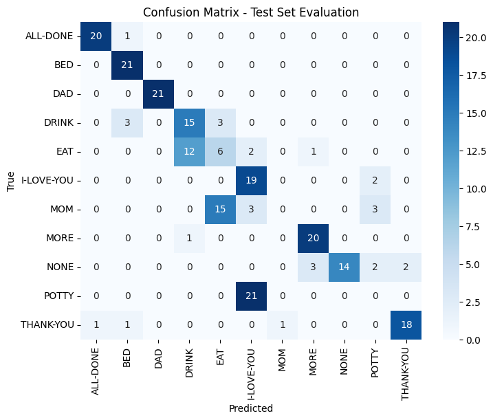

for some reason, the epoch stopped at 23/50, no indication of early stopping happened or my custom callback. still looks good. Werid is that loss graph, what is up with those bumps...

This really is a luck game

Test Loss: 1.3155463933944702
Test Accuracy: 0.5541125535964966

    InputLayer(shape=(sequence_length, 1666)),
    
    Conv1D(127, kernel_size=5),

    Flatten(),
    
    Dense(128, kernel_regularizer=L2(0.0001)),
    BatchNormalization(),
    Activation("relu6"),
    Dropout(0.5),
    Dense(len(class_labels), activation='softmax', kernel_regularizer=L2(1e-7))

Test Loss: 0.8309436440467834
Test Accuracy: 0.6666666865348816

    InputLayer(shape=(sequence_length, 1666)),
    
    Conv1D(127, kernel_size=3),
    Activation("relu"),
    MaxPooling1D(3),
    Flatten(),
   
    Dense(128, kernel_regularizer=L2(0.0001)),
    BatchNormalization(),
    Activation("relu6"),
    Dropout(0.5),
    Dense(128, kernel_regularizer=L2(0.0001)),
    BatchNormalization(),
    Activation("tanh"),
    Dropout(0.5),
    Dense(len(class_labels), activation='softmax', kernel_regularizer=L2(1e-7))

Test Loss: 0.8621662259101868
Test Accuracy: 0.7792207598686218
    InputLayer(shape=(sequence_length, 1666)),
    
    Conv1D(127, kernel_size=3),
    Activation("relu"),
    MaxPooling1D(3),
    Flatten(),
    
    Dense(128, kernel_regularizer=L2(0.0001)),
    BatchNormalization(),
    Activation("leaky_relu"),
    Dropout(0.5),
    Dense(128, kernel_regularizer=L2(0.0001)),
    BatchNormalization(),
    Activation("tanh"),
    Dropout(0.5),
    Dense(len(class_labels), activation='softmax', kernel_regularizer=L2(1e-7))

Test Loss: 0.8409031629562378
Test Accuracy: 0.7186146974563599
    InputLayer(shape=(sequence_length, 1666)),
    
    Conv1D(128, kernel_size=3),
    Activation("relu"),
    MaxPooling1D(3),

    Conv1D(128, kernel_size=3),
    Activation("relu"),
    MaxPooling1D(3),

    GlobalMaxPooling1D(),  # Instead of Flatten
    
    Dense(128, kernel_regularizer=L2(0.0001)),
    BatchNormalization(),
    Activation("leaky_relu"),
    Dropout(0.5),
    Dense(128, kernel_regularizer=L2(0.0001)),
    BatchNormalization(),
    Activation("tanh"),
    Dropout(0.5),
    Dense(len(class_labels), activation='softmax', kernel_regularizer=L2(1e-7))

Test Loss: 0.9042438864707947
Test Accuracy: 0.6969696879386902
    InputLayer(shape=(sequence_length, 1666)),
    
    Conv1D(128, kernel_size=3),
    Activation("relu"),
    MaxPooling1D(3),
    BatchNormalization(),
    Dropout(0.123),

    Conv1D(128, kernel_size=3),
    Activation("relu"),
    MaxPooling1D(3),
    BatchNormalization(),

    GlobalMaxPooling1D(),  # Instead of Flatten
    
    Dense(128, kernel_regularizer=L2(0.0001)),
    BatchNormalization(),
    Activation("leaky_relu"),
    Dropout(0.5),
    Dense(128, kernel_regularizer=L2(0.0001)),
    BatchNormalization(),
    Activation("tanh"),
    Dropout(0.5),
    Dense(len(class_labels), activation='softmax', kernel_regularizer=L2(1e-7))
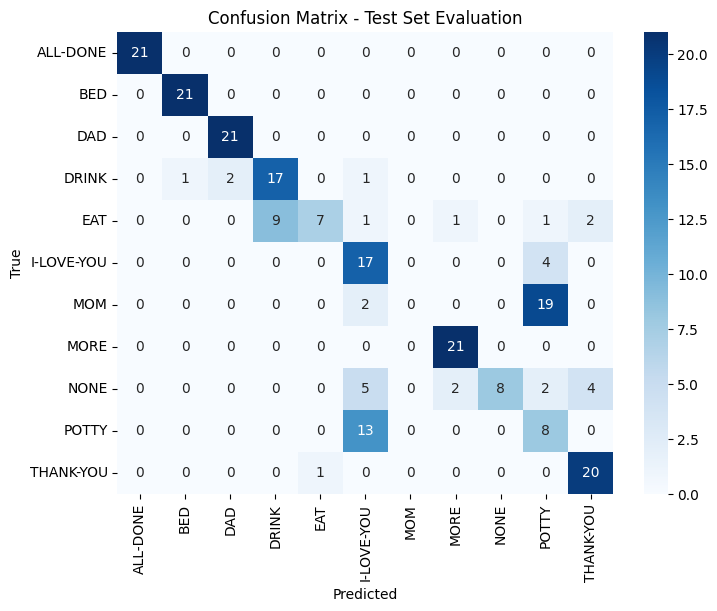
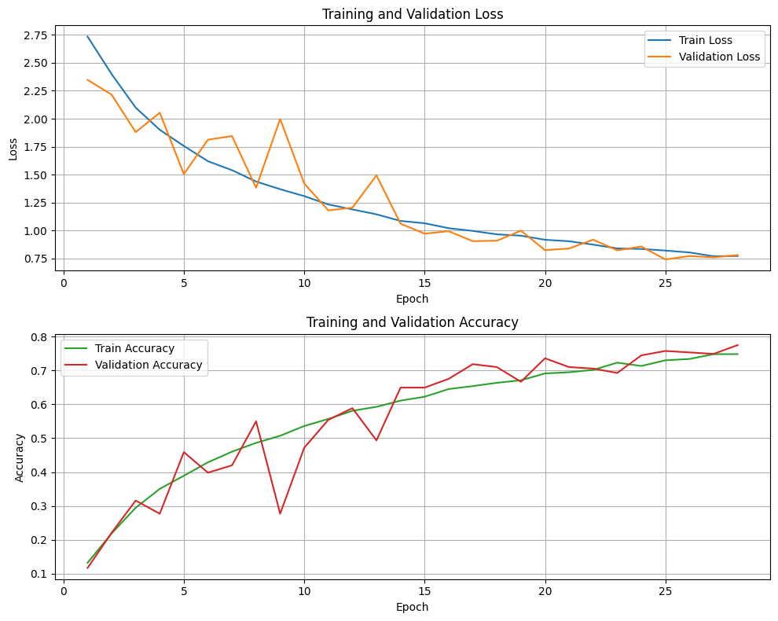

Test Loss: 0.8379583358764648
Test Accuracy: 0.7359307408332825
    InputLayer(shape=(sequence_length, 1666)),
    
    Conv1D(128, kernel_size=3),
    Activation("relu"),
    MaxPooling1D(3),
    BatchNormalization(),
    Dropout(0.123),
    
    Conv1D(128, kernel_size=3),
    LayerNormalization(),
    Activation("relu"),
    MaxPooling1D(3),
    BatchNormalization(),
    

    GlobalMaxPooling1D(),  # Instead of Flatten

    
    Dense(128, kernel_regularizer=L2(0.0001)),
    BatchNormalization(),
    Activation("leaky_relu"),
    Dropout(0.5),

    Dense(128, kernel_regularizer=L2(0.0001)),
    BatchNormalization(),

    Dense(96, bias_regularizer=L2(0.00001)),
    BatchNormalization(),
    Activation("tanh"),
    Dropout(0.08),

    Activation("tanh"),
    Dropout(0.5),
    Dense(len(class_labels), activation='softmax', kernel_regularizer=L2(1e-7))
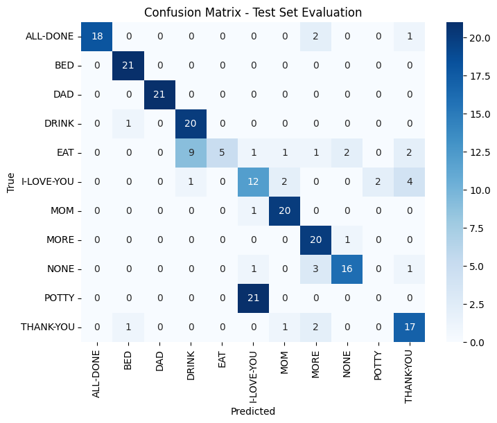
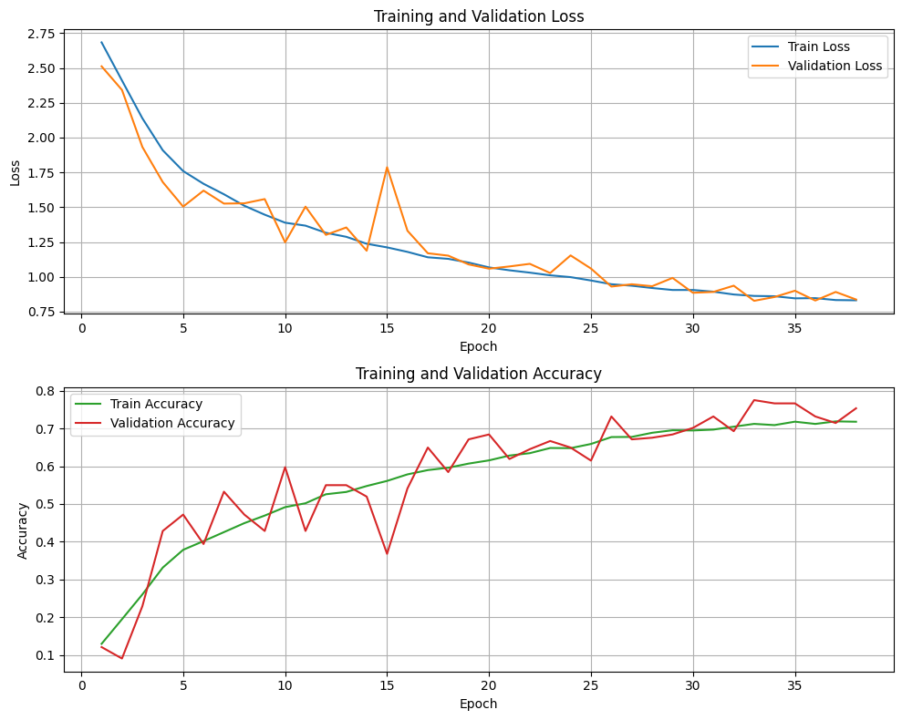

NOTE: according to the GPT, the GlobalMaxPooling1D shows the model elikes a moer focused and less param-heavy representation of the temporal data

Test Loss: 0.7620430588722229
Test Accuracy: 0.761904776096344
 InputLayer(shape=(sequence_length, 1666)),
    
    Conv1D(128, kernel_size=3),
    Activation("relu"),
    MaxPooling1D(3),
    BatchNormalization(),
    Dropout(0.123),

    # Dense(100, kernel_regularizer=L2(0.000001)),
    # Activation("tanh"),
    
    Conv1D(128, kernel_size=3),
    LayerNormalization(),
    Activation("relu"),
    MaxPooling1D(3),
    BatchNormalization(),

    Bidirectional(GRU(128, return_sequences=True)),   
    LayerNormalization(),
    Activation("tanh"),
    BatchNormalization(),
    Dropout(0.01),

    # Bidirectional(GRU(128, return_sequences=True)),   
    # LayerNormalization(),

    # GRU(96, return_sequences=True),
    # BatchNormalization(),

    GlobalMaxPooling1D(),  # Instead of Flatten
    
    Dense(128, kernel_regularizer=L2(0.0001)),
    BatchNormalization(),
    Activation("leaky_relu"),
    Dropout(0.5),

    Dense(128, kernel_regularizer=L2(0.0001)),
    BatchNormalization(),

    Dense(96, bias_regularizer=L2(0.00001)),
    BatchNormalization(),
    Activation("tanh"),
    Dropout(0.08),

    Activation("tanh"),
    Dropout(0.5),
    Dense(len(class_labels), activation='softmax', kernel_regularizer=L2(1e-7))
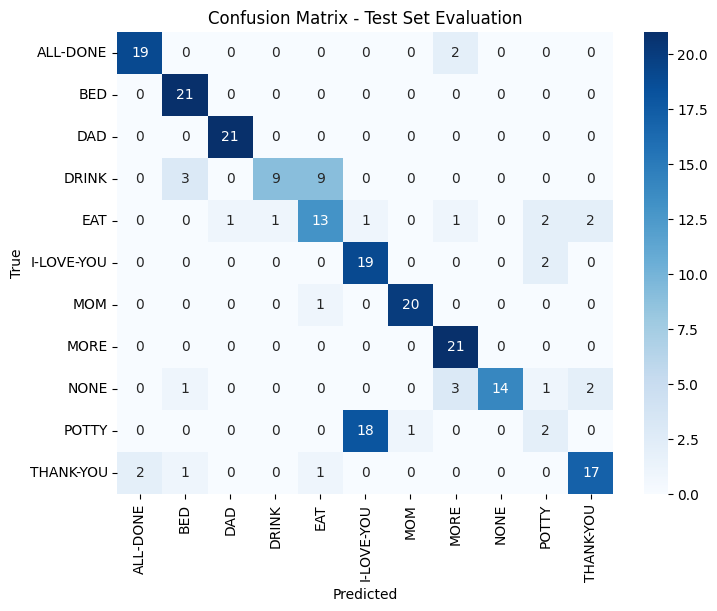
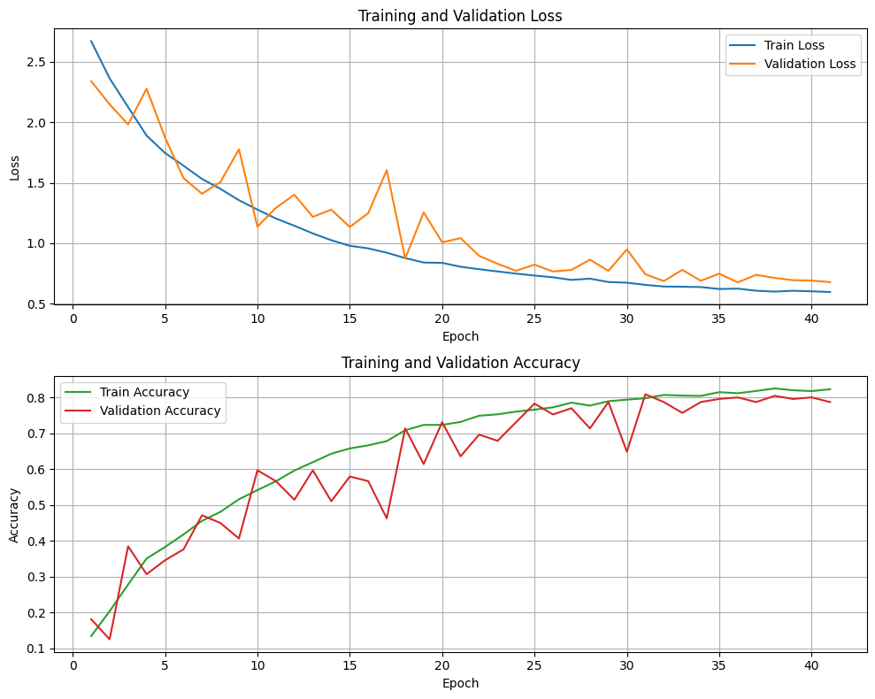

Test Loss: 0.8189589977264404
Test Accuracy: 0.7316017150878906
NOTE: this isn't really an improvement, but the matrix is much better, the potty is acutally being detected
    InputLayer(shape=(sequence_length, 1666)),
    
    Conv1D(128, kernel_size=3),
    Activation("relu"),
    MaxPooling1D(3),
    BatchNormalization(),
    Dropout(0.123),

    # Dense(100, kernel_regularizer=L2(0.000001)),
    # Activation("tanh"),
    
    Conv1D(128, kernel_size=3),
    LayerNormalization(),
    Activation("relu6"),
    MaxPooling1D(3),
    BatchNormalization(),

    Bidirectional(GRU(128, return_sequences=True)),   
    LayerNormalization(),
    Activation("tanh"),
    BatchNormalization(),
    Dropout(0.1),

    # Bidirectional(GRU(128, return_sequences=True)),   
    # LayerNormalization(),

    # GRU(96, return_sequences=True),
    # BatchNormalization(),

    GlobalMaxPooling1D(),  # Instead of Flatten
    
    Dense(128, kernel_regularizer=L2(0.0001)),
    BatchNormalization(),
    Activation("leaky_relu"),
    Dropout(0.5),

    Dense(128, kernel_regularizer=L2(0.0001)),
    BatchNormalization(),

    Dense(96, bias_regularizer=L2(0.00001)),
    BatchNormalization(),
    Activation("tanh"),
    Dropout(0.08),

    Activation("tanh"),
    Dropout(0.5),
    Dense(len(class_labels), activation='softmax', kernel_regularizer=L2(1e-7))
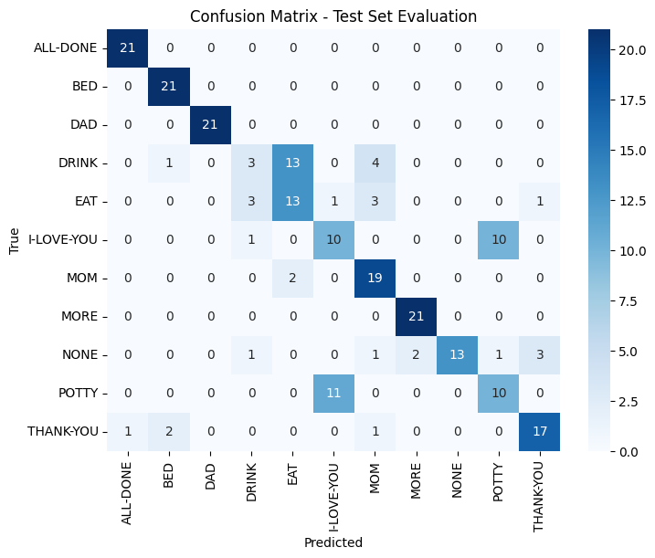
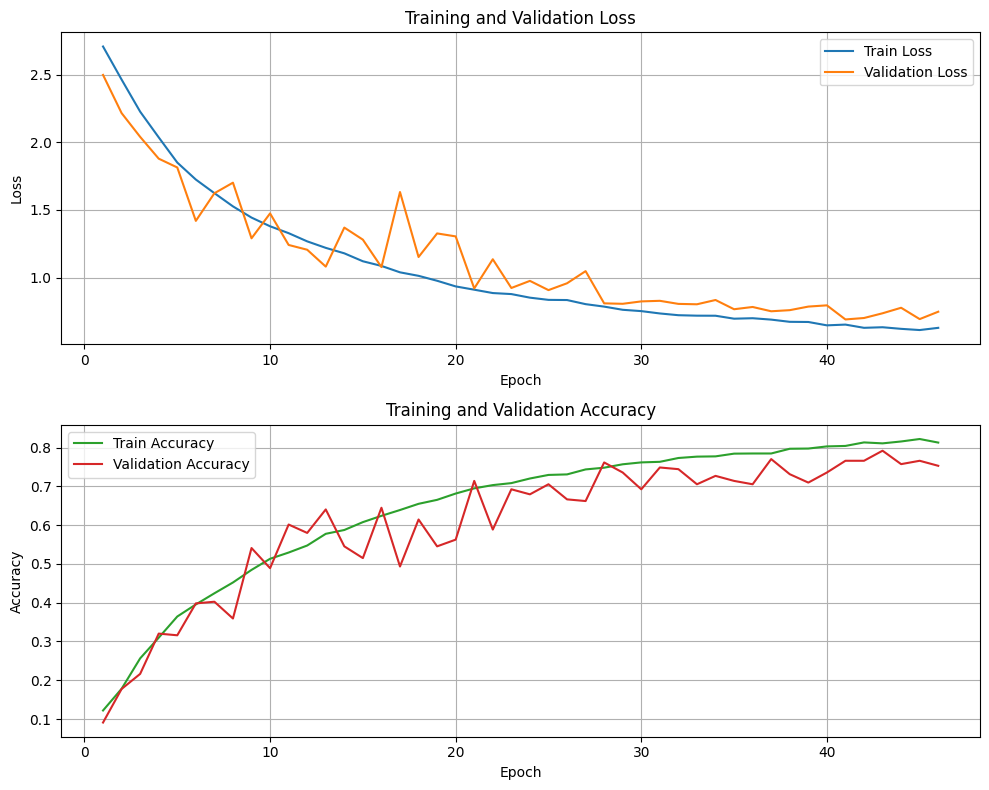

Test Loss: 0.71469646692276
Test Accuracy: 0.761904776096344
    InputLayer(shape=(sequence_length, 1666)),
    
    Conv1D(128, kernel_size=3),
    Activation("relu"),
    MaxPooling1D(3),
    BatchNormalization(),
    Dropout(0.153),

    # Dense(100, kernel_regularizer=L2(0.000001)),
    # Activation("tanh"),
    
    Conv1D(128, kernel_size=3),
    LayerNormalization(),
    Activation("relu6"),
    MaxPooling1D(3),
    BatchNormalization(),

    Bidirectional(GRU(128, return_sequences=True)),   
    LayerNormalization(),
    Activation("tanh"),
    BatchNormalization(),
    Dropout(0.125),

    # Bidirectional(GRU(128, return_sequences=True)),   
    # LayerNormalization(),

    # GRU(96, return_sequences=True),
    # BatchNormalization(),

    GlobalMaxPooling1D(),  # Instead of Flatten
    
    Dense(128, kernel_regularizer=L2(0.0001)),
    BatchNormalization(),
    Activation("leaky_relu"),
    Dropout(0.5),

    Dense(128, kernel_regularizer=L2(0.0001)),
    BatchNormalization(),

    Dense(96, bias_regularizer=L2(0.00001)),
    BatchNormalization(),
    Activation("tanh"),
    Dropout(0.08),

    Activation("tanh"),
    Dropout(0.5),
    Dense(len(class_labels), activation='softmax', kernel_regularizer=L2(1e-7))

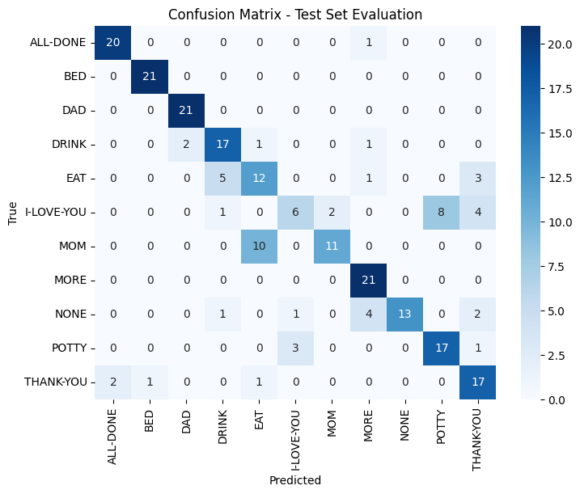
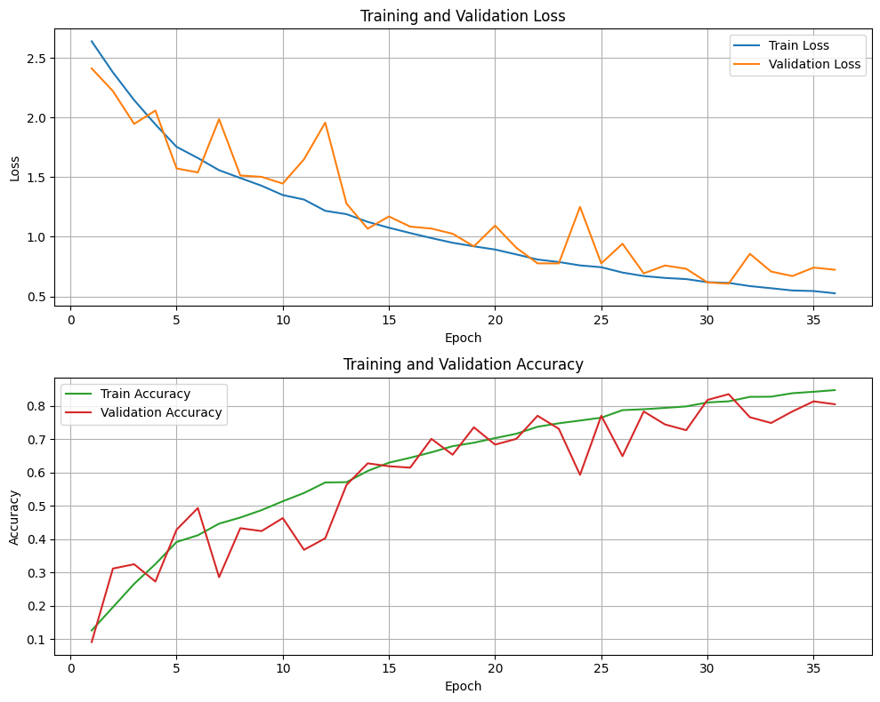

model quatre v3 has the things I like, not as good as the previous best, but the 
Test Loss: 0.7827021479606628
Test Accuracy: 0.7402597665786743
Conv1D(128, kernel_size=3),
    Activation("relu6"),
    MaxPooling1D(3),
    BatchNormalization(),
    Dropout(0.153),

    Conv1D(128, kernel_size=3),
    LayerNormalization(),
    Activation("relu6"),
    MaxPooling1D(3),
    BatchNormalization(),

    Bidirectional(GRU(128, return_sequences=True)),   
    LayerNormalization(),
    Activation("tanh"),
    BatchNormalization(),
    Dropout(0.135),

    # Bidirectional(GRU(128, return_sequences=True)),   
    # LayerNormalization(),

    # GRU(96, return_sequences=True),
    # BatchNormalization(),

    GlobalMaxPooling1D(),  # Instead of Flatten

    Dense(128, kernel_regularizer=L2(1e-4)),
    BatchNormalization(),
    Activation("leaky_relu"),
    Dropout(0.5),

    Dense(128, kernel_regularizer=L2(1e-4)),
    BatchNormalization(),

    Dense(96, bias_regularizer=L2(1e-5)),
    BatchNormalization(),
    Activation("tanh"),
    Dropout(0.08),

    Activation("tanh"),
    Dropout(0.5),
    Dense(len(class_labels), activation='softmax', kernel_regularizer=L2(1e-7))

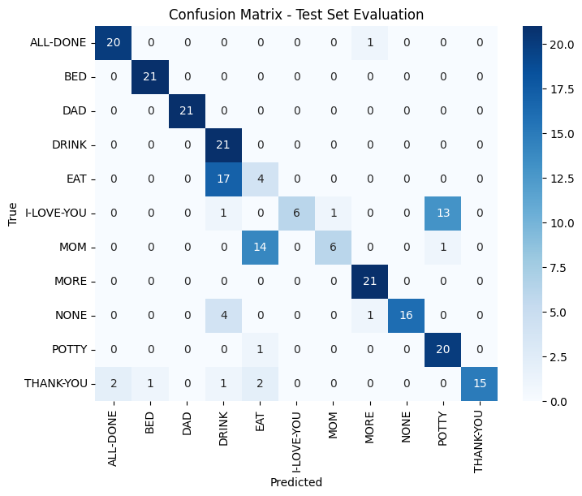
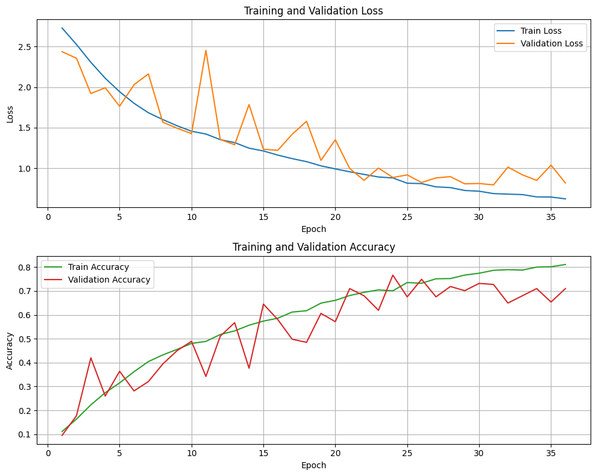

Test Loss: 1.034582495689392
Test Accuracy: 0.6190476417541504
going forward, we have doubled the training data, different model because the current doesn't work with that much data...

    InputLayer(shape=(sequence_length, X_train_sequences.shape[2])),
    
    Conv1D(256, kernel_size=3),
    LayerNormalization(),
    Activation("relu"),
    MaxPooling1D(3),
    BatchNormalization(),
    Dropout(0.153),

    Conv1D(128, kernel_size=3),
    LayerNormalization(),
    Activation("relu"),
    MaxPooling1D(3),
    BatchNormalization(),
    Dropout(0.035),

    Bidirectional(GRU(128, return_sequences=True)),   
    LayerNormalization(),
    Activation("tanh"),
    BatchNormalization(),
    Dropout(0.135),

    Bidirectional(GRU(128, return_sequences=True)),   
    LayerNormalization(),
    Activation("tanh"),
    BatchNormalization(),
    Dropout(0.135),

    GlobalMaxPooling1D(),

    Dense(256, kernel_regularizer=L2(1e-4)),
    BatchNormalization(),
    Activation("leaky_relu"),
    Dropout(0.5),

    Dense(256, kernel_regularizer=L2(1e-4)),
    BatchNormalization(),
    Activation("tanh"),
    Dropout(0.55),

    Dense(128),
    BatchNormalization(),
    Activation("tanh"),
    Dropout(0.08),

    Dense(64, kernel_regularizer=L2(1e-3)),
    BatchNormalization(),
    Activation("tanh"),
    Dropout(0.2),
    
    Activation("tanh"),
    Dropout(0.5),
    Dense(len(class_labels), activation="softmax", kernel_regularizer=L2(1e-7))