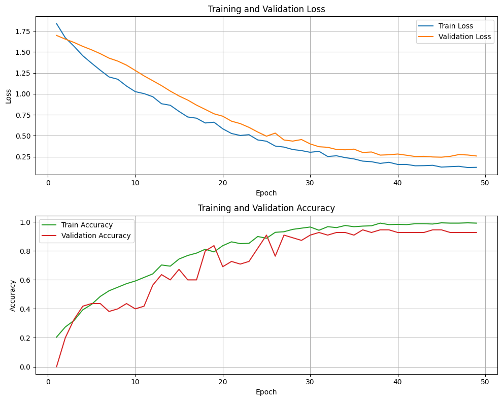
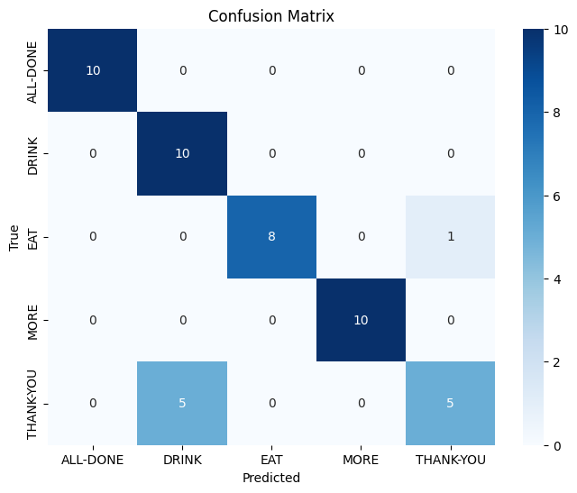
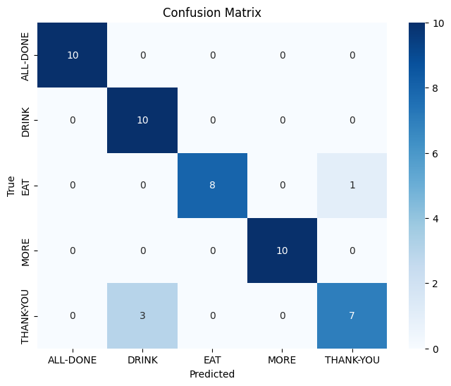
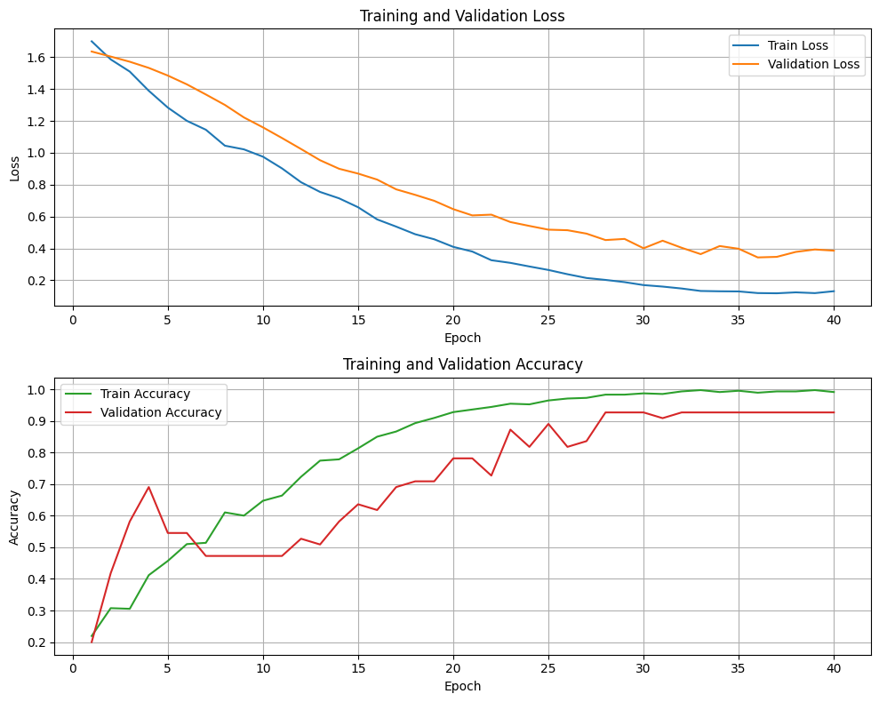
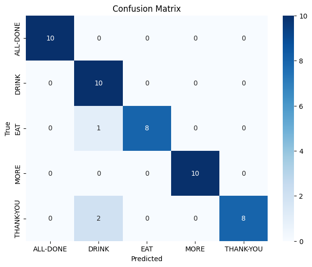
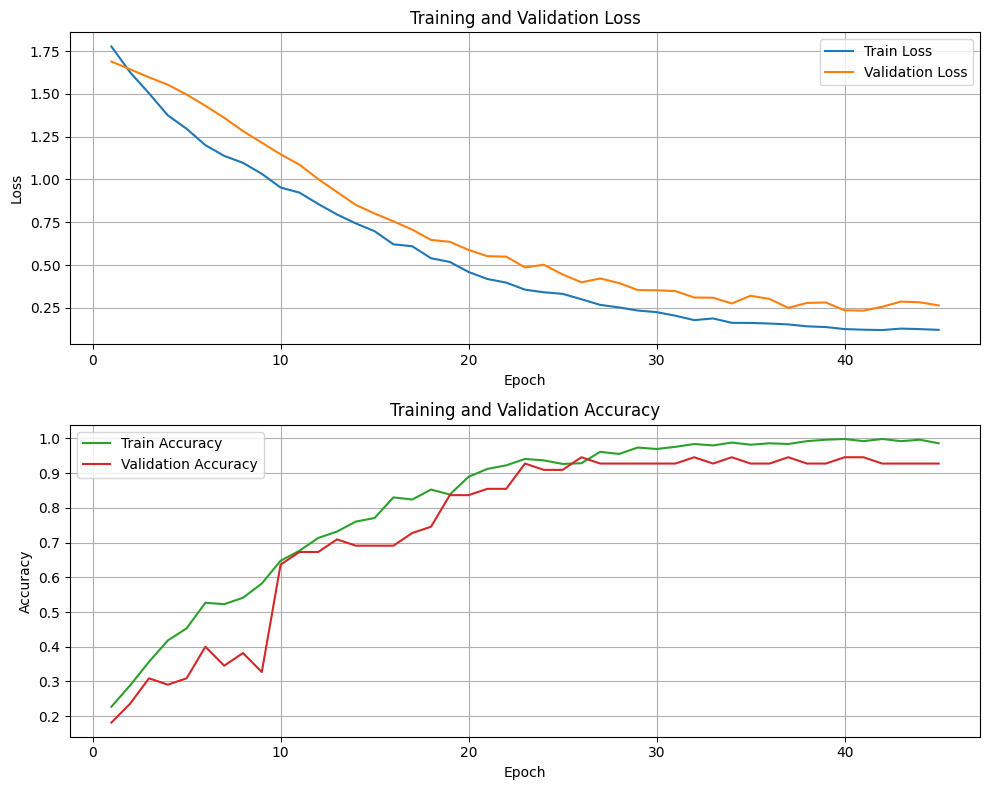

we need to normalize the raw xyz coords

feature engineering - transforming raw data and creating features to improve the prediction 

feature selection - selecting key dataset features to reduce dimensionality

    from sklearn.model_selection import TimeSeriesSplit

    def main():
        input_dir = "data/"
        dataframe = create_dataframe_from_data(input_dir).dropna()

        X = dataframe.drop(columns=['gesture'], axis=1)
        y = dataframe['gesture']

        # Split into train and test sets
        X_train, X_test, y_train, y_test = train_test_split(X, y, test_size=0.2, random_state=42, shuffle=False)

        # Perform feature engineering on X_train and X_test...

        # Use TimeSeriesSplit for cross-validation on the training set
        tscv = TimeSeriesSplit(n_splits=5)
        for train_index, val_index in tscv.split(X_train):
            X_train_fold, X_val_fold = X_train.iloc[train_index], X_train.iloc[val_index]
            y_train_fold, y_val_fold = y_train.iloc[train_index], y_train.iloc[val_index]

            # Train and evaluate your model on each fold...

    """
    method 1 in spliting the data
    for a given gesture_index, take 70 for trainning and 15/15 for val and test
    """

The quote "Feature engineering should focus on extracting features from the entire sequence rather than individually" is crucial for time series data like gestures.

Your current implementation seems to address this by calculating features like velocity and acceleration, which depend on multiple data points within the sequence (not individual frames).
However, the relative landmark angles might need further consideration. Are you calculating angles for each frame within the sequence, or for the entire gesture?
Recommendations:

If you intend to capture the overall gesture motion through angles, consider calculating them over the entire sequence (e.g., average or maximum angle) instead of for each frame.
Explore additional features that capture the gesture dynamics across the entire sequence, such as range of motion for each landmark or average speed.
By implementing these solutions and refining your feature engineering based on the "important quote," you can ensure consistent data shapes and potentially improve your gesture recognition model's performance.

old code 
def calculate_temporal_features_per_gesture(df: pd.DataFrame, landmark_cols: list):

    velocity_cols = [f"velocity_{col}" for col in landmark_cols]
    acceleration_cols = [f"acceleration_{col}" for col in landmark_cols]
    jerk_cols = [f"jerk_{col}" for col in landmark_cols]

    nan_df = pd.DataFrame(columns=velocity_cols + acceleration_cols + jerk_cols, dtype=float)
    df = pd.concat([df, nan_df], axis=1)

    df = df.sort_values(by=["gesture_index", "frame"])

    for _, gesture_data in df.groupby("gesture_index"):
        gesture_data_sorted = gesture_data.sort_values(by="frame")

        # Calculate time differences based on frame rate
        avg_frame_rate = np.mean(gesture_data_sorted["frame_rate"])
        time_diffs = gesture_data_sorted["frame"].diff().fillna(1) / avg_frame_rate
        
        # Calculate velocity (first derivative)
        velocities = gesture_data_sorted[landmark_cols].diff().div(time_diffs, axis=0).fillna(0)
        df.loc[gesture_data_sorted.index, velocity_cols] = velocities.values

        # Calculate acceleration (second derivative)
        accelerations = velocities.diff().div(time_diffs, axis=0).fillna(0)
        df.loc[gesture_data_sorted.index, acceleration_cols] = accelerations.values

        # Calculate jerk (third derivative)
        jerks = accelerations.diff().div(time_diffs, axis=0).fillna(0)
        df.loc[gesture_data_sorted.index, jerk_cols] = jerks.values

    return df

def calculate_landmark_distances(df: pd.DataFrame, landmark_cols: list):

    landmark_pairs = list(combinations(landmark_cols, 2))
    distance_columns = [f'distance_{idx1}_{idx2}' for idx1, idx2 in landmark_pairs]

    distance_data = []

    for _, gesture_data in df.groupby("gesture_index"):

        gesture_data = gesture_data.sort_values(by="frame")

        for(col1, col2) in landmark_pairs:
            idx1 = col1[1:]
            idx2 = col2[1:]

            x1, y1, z1 = f'x{idx1}', f'y{idx1}', f'z{idx1}'
            x2, y2, z2 = f'x{idx2}', f'y{idx2}', f'z{idx2}'

            if all(pd.api.types.is_numeric_dtype(gesture_data[col]) for col in [x1, y1, z1, x2, y2, z2]): 
                distances = np.sqrt((gesture_data[x1] - gesture_data[x2])**2 + (gesture_data[y1] - gesture_data[y2])**2 + (gesture_data[z1] - gesture_data[z2])**2)
                distance_data.append(distances)

            else:
                raise ValueError("Landmark data types must be numeric for distance calculation")

    # Concatenate distance columns with original DataFrame
    df = pd.concat([df, distance_data], axis=1)

    return df  

def calculate_landmark_angles(df: pd.DataFrame, landmark_cols: list):
    angles_per_gesture_list = [] 

    for gesture_index, gesture_data in df.groupby("gesture_index"):
        gesture_data = gesture_data.sort_values(by="frame")
        gesture_points = gesture_data[landmark_cols].values# Calculate direction vectors between consecutive frames (we are using all the landmarks)
        
        gesture_vectors = np.diff(gesture_points, axis=0)

        if gesture_vectors.shape[0] < 2:
            continue

        # Calculate dot product and magnitudes (assuming 3D points)
        dot_products = np.sum(gesture_vectors[:-1] * gesture_vectors[1:], axis=1)
        magnitude1 = np.linalg.norm(gesture_vectors[:-1], axis=1)
        magnitude2 = np.linalg.norm(gesture_vectors[1:], axis=1)

        # Avoid dividing by zero or near-zero values
        mask = (magnitude1 > 1e-6) & (magnitude2 > 1e-6)
        dot_products[mask] /= (magnitude1[mask] * magnitude2[mask])

        # clip values stop prevent invalid input to arccos 
        dot_products = np.clip(dot_products, -1.0, 1.0)

        frame_angles = np.arccos(dot_products) * (180 / np.pi)

        # create dictionary with angles for each gesture
        angles_df = pd.DataFrame({
            'gesture_index': gesture_index,
            'frame': gesture_data['frame'].iloc[1:len(frame_angles)+1],  # Skip the first frame because diff reduces one row
            'angle': frame_angles
        })
        angles_per_gesture_list.append(angles_df)

    all_angles_df = pd.concat(angles_per_gesture_list, ignore_index=True)

    # Merge the angles DataFrame back to the original DataFrame
    df_with_angles = pd.merge(df, all_angles_df, on=['gesture_index', 'frame'], how='left')

    return df_with_angles

def calculate_gesture_stats(df: pd.DataFrame, landmark_cols: list, window_size: int = 5):
    # Create a dictionary to hold the rolling statistics
    stats_dict = {f"mean_{col}": [] for col in landmark_cols}
    stats_dict.update({f"var_{col}": [] for col in landmark_cols})
    stats_dict.update({f"skew_{col}": [] for col in landmark_cols})
    stats_dict.update({f"kurt_{col}": [] for col in landmark_cols})

    # Iterate through each gesture
    for gesture_index, gesture_data in df.groupby("gesture_index"):
        for col in landmark_cols:
            rolling_window = gesture_data[col].rolling(window=window_size, min_periods=1)
            
            stats_dict[f"mean_{col}"].extend(rolling_window.mean().tolist())
            stats_dict[f"var_{col}"].extend(rolling_window.var().tolist())
            stats_dict[f"skew_{col}"].extend(rolling_window.skew().tolist())
            stats_dict[f"kurt_{col}"].extend(rolling_window.kurt().tolist())
    
    # Convert stats_dict to DataFrame
    stats_df = pd.DataFrame(stats_dict, index=df.index)
    
    # Merge the original DataFrame with the stats DataFrame
    result_df = pd.concat([df, stats_df], axis=1)
    
    return result_df

NOTE: consider doing an overall means/va/dev on related gestures as a feature

NOTE:
gesture index probably shouldn't be in the dataset, also get really bad results from new data

scarping v2 model, moving toward v3

update: cnn_lstm v1 got this result

honestly, not bad, but could be better, getting arouond 0.41 in loss for test and 0.87 in test acc

so after doing some manually tunning, got this for model_dev

the model is technically worst, but when running the the test and acc loss:
Test Loss: 0.3159714937210083
Test Accuracy: 0.918367326259613

is was higher compared to this: - current model
Test Loss: 0.41919127106666565
Test Accuracy: 0.8775510191917419

so new model, after tweaking like one thing go this (from the model_dev series)

this got a test loss/acc of 0.28 and 0.93

TODO:
- a none/other dataset
- more data of existing getures
- a few new gestures (want maybe 10 in total)
- a way to do do continuous machine learning - CML (process which model learns from new data without re-training)
 - look at PNN
 - freezing params to prevent catastrophic forgetting
 - 
- a better program to demo the program
- android project?
- web project?